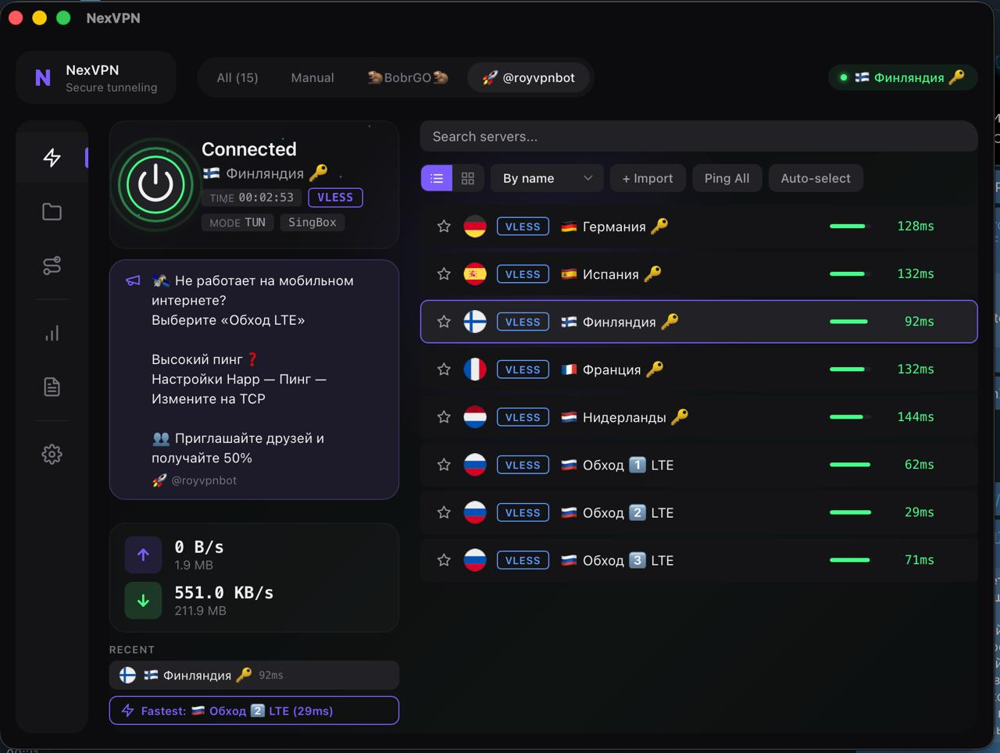

# NexVPN

Open-source VPN client built with Tauri, React and Rust. Supports multiple proxy protocols via **sing-box** and **Xray-core** engines.

**[Russian version / Русская версия](README_RU.md)**

## Screenshots

### Windows


### macOS


### Android


## Features

- **Multi-protocol** — VLESS, VMess, Shadowsocks, Trojan, Hysteria2, TUIC
- **Dual core** — switch between sing-box and Xray-core in one click
- **Subscriptions** — import and auto-update subscription URLs
- **Link import** — paste `vless://`, `vmess://`, `ss://`, `trojan://` links directly
- **Routing rules** — domain-based rules (proxy / direct / block) with quick presets for ads blocking and regional bypass
- **Split tunneling** — choose default route: proxy all traffic or only selected domains (Direct All mode)
- **System Proxy & TUN mode** — system HTTP proxy or full TUN VPN (captures all traffic)
- **TCP ping** — single and bulk server latency testing, auto-select best server
- **Themes** — 4 color themes (Dark, Light, Midnight, Cyber)
- **Styles** — Default, Modern Minimal, Glassmorphism, Neon Glow
- **Animations** — None, Smooth, Energetic (configurable, CSS-only)
- **Statistics** — connection history, traffic totals, live speed graph
- **i18n** — English and Russian
- **HWID** — optional device fingerprint for panel-based subscriptions
- **Cross-platform** — Windows, macOS, Android from a single codebase
- **Lightweight** — single binary, no Electron, ~16 MB app size

## Download

Pre-built installers for Windows (x64), macOS (Apple Silicon) and Android (APK) are available on the [Releases](../../releases) page.

## Building from source

### Requirements

- [Rust](https://rustup.rs/) 1.70+
- [Node.js](https://nodejs.org/) 18+
- Tauri CLI: `cargo install tauri-cli`

### 1. Clone the repository

```bash
git clone https://github.com/TopPro104/nexvpn.git
cd nexvpn
```

### 2. Install dependencies

```bash
npm install
```

### 3. Download proxy cores

The script downloads sing-box and Xray-core binaries and places them in `src-tauri/binaries/` with the correct Tauri target-triple names:

```bash
# Linux / macOS
chmod +x download-cores.sh
./download-cores.sh

# Windows (Git Bash)
bash download-cores.sh
```

The script auto-detects your platform via `rustc`. You can specify a target explicitly:

```bash
./download-cores.sh x86_64-pc-windows-msvc
```

For TUN mode on Windows, also place `wintun.dll` in `src-tauri/binaries/`.

### 4. Run or build

```bash
# Development
cargo tauri dev

# Production build (creates installer)
cargo tauri build
```

## Project structure

```
nexvpn/
├── src/                        # React frontend
│   ├── api/tauri.ts            # Tauri IPC bindings
│   ├── components/             # UI components
│   ├── context/AppContext.tsx   # Global state (useReducer)
│   ├── hooks/                  # useTheme, useStatus
│   ├── i18n/translations.ts    # EN/RU translations
│   ├── themes/                 # Color theme definitions
│   └── index.css               # All styles (no CSS framework)
├── src-tauri/src/
│   ├── lib.rs                  # Tauri app setup
│   ├── commands.rs             # IPC commands (frontend <-> Rust)
│   ├── core/
│   │   ├── manager.rs          # Core process lifecycle
│   │   ├── singbox.rs          # sing-box config generation
│   │   └── xray.rs             # Xray config generation
│   ├── proxy/
│   │   ├── models.rs           # Data models (Server, Settings, etc.)
│   │   ├── link_parser.rs      # Protocol link parser
│   │   └── subscription.rs     # Subscription fetcher
│   ├── system/
│   │   ├── proxy_setter.rs     # Windows system proxy control
│   │   └── hwid.rs             # Device fingerprint
│   └── testing/
│       └── ping.rs             # TCP latency testing
├── download-cores.sh           # Core binary downloader
├── LICENSE
└── README.md
```

## Community

Join our Telegram group for updates, support, and discussion:

[](https://t.me/NexVPNcom)

## License

[MIT License](LICENSE) — free to use, modify, and distribute. See LICENSE for details.

## Publisher

HorusVPN
