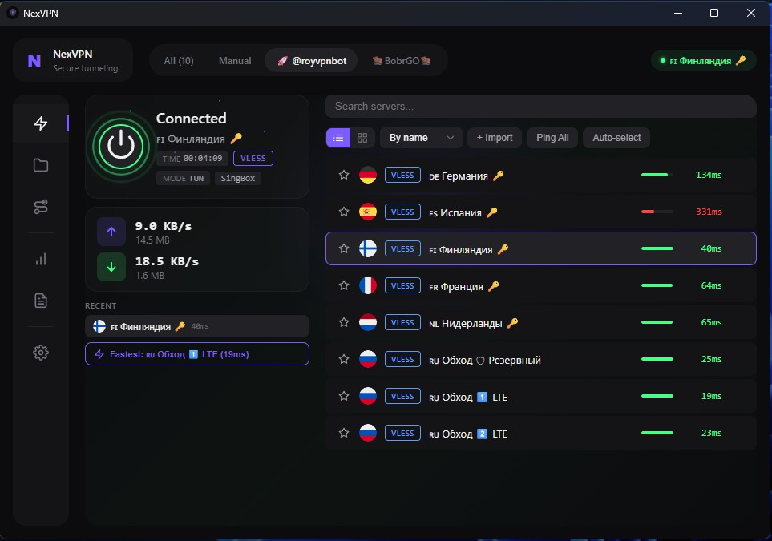
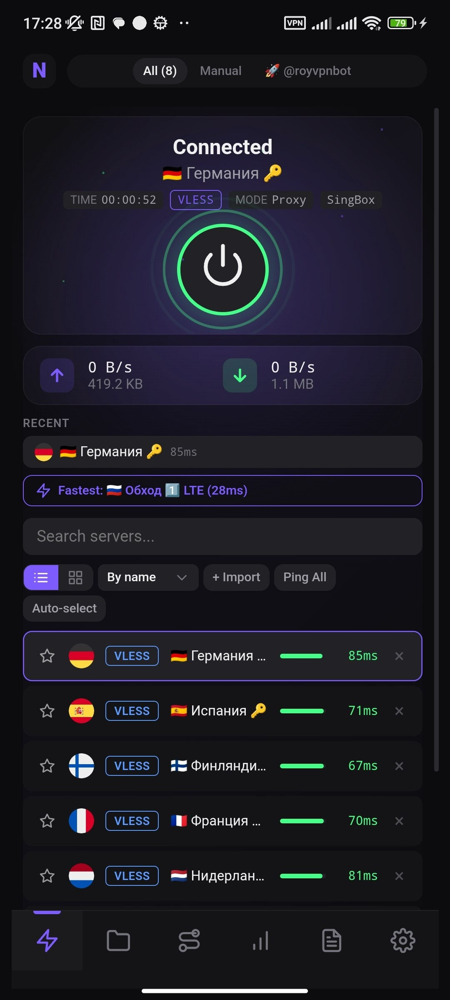

# NexVPN

VPN-клиент с открытым исходным кодом на Tauri, React и Rust. Поддержка множества прокси-протоколов через движки **sing-box** и **Xray-core**.

**[English version](README.md)**

## Скриншоты

### Десктоп


### Мобильное приложение


## Возможности

- **Мульти-протокол** — VLESS, VMess, Shadowsocks, Trojan, Hysteria2, TUIC
- **Два ядра** — переключение между sing-box и Xray-core в один клик
- **Подписки** — импорт и автообновление подписок по URL
- **Импорт ссылок** — вставьте `vless://`, `vmess://`, `ss://`, `trojan://` ссылки напрямую
- **Системный прокси и TUN** — HTTP-прокси в системе или полный TUN VPN (весь трафик)
- **TCP пинг** — проверка задержки серверов, автовыбор лучшего
- **Темы** — 4 цветовых темы (Dark, Light, Midnight, Cyber)
- **Стили** — Default, Modern Minimal, Glassmorphism, Neon Glow
- **Анимации** — Без анимаций, Плавная, Энергичная (настраиваемо, чистый CSS)
- **Статистика** — история подключений, объём трафика, график скорости в реальном времени
- **Языки** — English и Русский
- **HWID** — опциональная отправка данных устройства для панельных подписок
- **Лёгкий** — один бинарник, без Electron, ~16 МБ

## Скачать

Готовые установщики для Windows (x64) и Android (APK) доступны на странице [Releases](../../releases).

## Сборка из исходников

### Требования

- [Rust](https://rustup.rs/) 1.70+
- [Node.js](https://nodejs.org/) 18+
- Tauri CLI: `cargo install tauri-cli`

### 1. Клонировать репозиторий

```bash
git clone https://github.com/TopPro104/nexvpn.git
cd nexvpn
```

### 2. Установить зависимости

```bash
npm install
```

### 3. Скачать ядра прокси

Скрипт скачает sing-box и Xray-core и положит их в `src-tauri/binaries/` с правильными именами:

```bash
# Linux / macOS
chmod +x download-cores.sh
./download-cores.sh

# Windows (Git Bash)
bash download-cores.sh
```

Скрипт автоматически определяет платформу через `rustc`. Можно указать явно:

```bash
./download-cores.sh x86_64-pc-windows-msvc
```

Для TUN-режима на Windows также положите `wintun.dll` в `src-tauri/binaries/`.

### 4. Запуск или сборка

```bash
# Режим разработки
cargo tauri dev

# Продакшн-сборка (создаёт установщик)
cargo tauri build
```

## Структура проекта

```
nexvpn/
├── src/                        # React-фронтенд
│   ├── api/tauri.ts            # Tauri IPC привязки
│   ├── components/             # UI-компоненты
│   ├── context/AppContext.tsx   # Глобальное состояние (useReducer)
│   ├── hooks/                  # useTheme, useStatus
│   ├── i18n/translations.ts    # EN/RU переводы
│   ├── themes/                 # Определения цветовых тем
│   └── index.css               # Все стили (без CSS-фреймворков)
├── src-tauri/src/
│   ├── lib.rs                  # Настройка Tauri-приложения
│   ├── commands.rs             # IPC-команды (фронт <-> Rust)
│   ├── core/
│   │   ├── manager.rs          # Жизненный цикл процессов ядер
│   │   ├── singbox.rs          # Генерация конфига sing-box
│   │   └── xray.rs             # Генерация конфига Xray
│   ├── proxy/
│   │   ├── models.rs           # Модели данных (Server, Settings и т.д.)
│   │   ├── link_parser.rs      # Парсер ссылок протоколов
│   │   └── subscription.rs     # Загрузчик подписок
│   ├── system/
│   │   ├── proxy_setter.rs     # Управление системным прокси Windows
│   │   └── hwid.rs             # Отпечаток устройства
│   └── testing/
│       └── ping.rs             # TCP-тестирование задержки
├── download-cores.sh           # Скрипт загрузки ядер
├── LICENSE
└── README.md
```

## Лицензия

[MIT License](LICENSE) — свободное использование, модификация и распространение. Подробности в файле LICENSE.

## Издатель

HorusVPN
