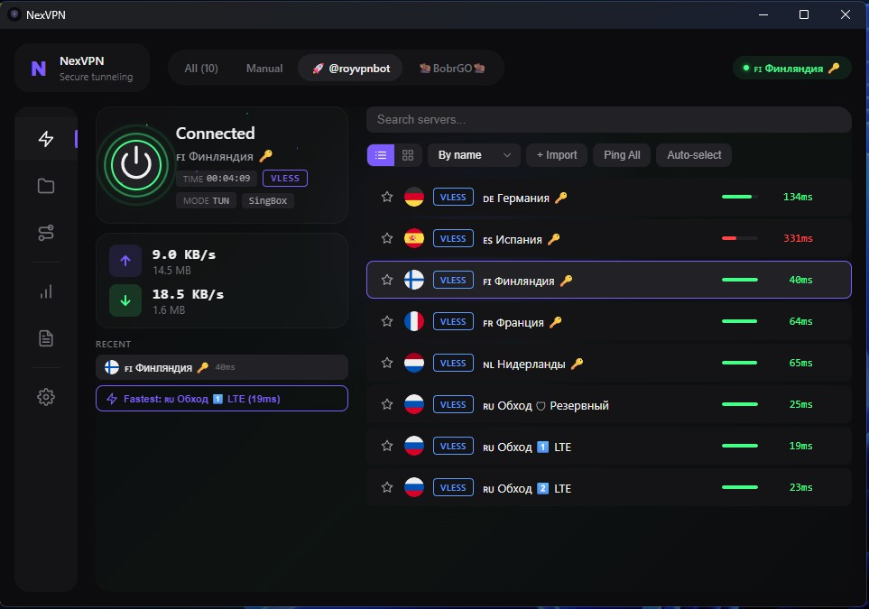
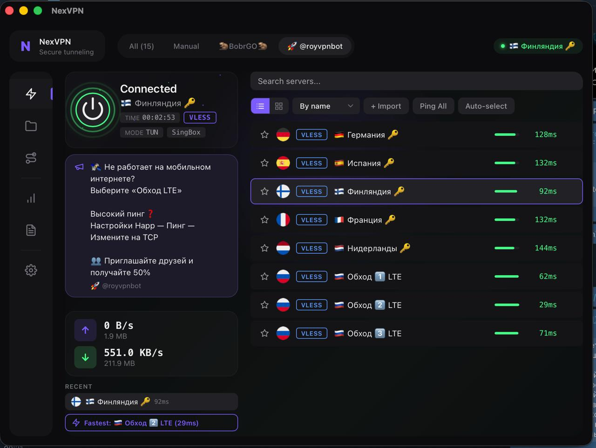
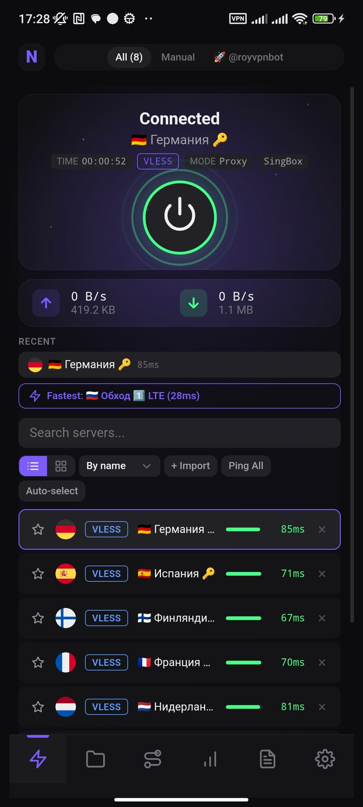

# NexVPN

VPN-клиент с открытым исходным кодом на Tauri, React и Rust. Поддержка множества прокси-протоколов через движки **sing-box** и **Xray-core**.

**[English version](README.md)**

## Скриншоты

### Windows


### macOS


### Android


## Возможности

- **Мульти-протокол** — VLESS, VMess, Shadowsocks, Trojan, Hysteria2, TUIC
- **Мульти-транспорт** — TCP, WebSocket, gRPC, HTTP/2, QUIC, xHTTP (splithttp), HTTPUpgrade
- **Два ядра** — переключение между sing-box и Xray-core в один клик
- **Подписки** — импорт и автообновление подписок по URL
- **Импорт ссылок** — вставьте `vless://`, `vmess://`, `ss://`, `trojan://` ссылки напрямую
- **Экспорт ссылок** — генерация ссылок для шаринга с любого сервера
- **Deep links** — открытие `nexvpn://import/URL` для добавления подписок из браузера
- **Правила маршрутизации** — доменные правила (proxy / direct / block) с готовыми шаблонами для блокировки рекламы и обхода региональных сайтов
- **VPN по приложениям** (Android) — выбор какие приложения идут через VPN, или исключение конкретных
- **Split tunneling** — выбор маршрута по умолчанию: весь трафик через VPN или только выбранные домены
- **Системный прокси и TUN** — HTTP-прокси в системе или полный TUN VPN (весь трафик)
- **Запрос прав админа** — кнопка «Запустить от имени администратора» для TUN-режима (Windows UAC / macOS sudo)
- **Антидетект** — рандомные порты, аутентификация на локальных прокси, секрет Clash API, защита от сканирования портов (Android)
- **Режим невидимости** (Android, root) — экспериментальное скрытие VPN: блокировка портов через iptables
- **Поддержка IPv6** — полная маршрутизация IPv6 через VPN-туннель, защита от IPv6-утечек
- **Kill switch** (Android) — при падении VPN-процесса TUN остаётся открытым, блокируя весь трафик до восстановления
- **Автопереподключение** — автоматическое переподключение при обрыве VPN-соединения
- **Онбоардинг** — интерактивная экскурсия по приложению для новых пользователей с выбором языка
- **TCP пинг** — проверка задержки серверов, автовыбор лучшего
- **VPN пинг** — измерение реальной задержки через VPN-туннель
- **Быстрое подключение** — недавние и рекомендованные серверы для подключения в один тап
- **Карта мира** — интерактивная карта расположения серверов
- **Темы** — 7 цветовых тем (Dark, Light, Midnight Blue, Cyberpunk, Aurora, Sunset, Matrix)
- **Стили** — Default, Modern Minimal, Glassmorphism, Neon Glow
- **Анимации** — Без анимаций, Плавная, Энергичная (настраиваемо, чистый CSS)
- **Статистика** — история подключений, объём трафика, график скорости с вкладками обзор/трафик/история
- **Логи** — просмотр логов в реальном времени с фильтрацией по уровню (Все / Ошибки / Предупреждения)
- **Языки** — English и Русский
- **HWID** — опциональная отправка данных устройства для панельных подписок
- **Горячие клавиши** — цифры (1-6) для навигации, Shift+D подключение/отключение, Shift+F поиск
- **Quick Settings** (Android) — переключение VPN из шторки уведомлений
- **Виджет** (Android) — статус VPN и кнопка переключения на домашнем экране
- **Адаптивный интерфейс** — плавающий сайдбар на десктопе и нижняя панель навигации на мобилке
- **Кроссплатформенный** — Windows, macOS, Linux, Android из одной кодовой базы
- **Лёгкий** — один бинарник, без Electron, ~16 МБ

## Скачать

Готовые установщики для Windows (x64), macOS (Apple Silicon) и Android (APK) доступны на странице [Releases](../../releases).

## Сборка из исходников

### Требования

- [Rust](https://rustup.rs/) 1.70+
- [Node.js](https://nodejs.org/) 18+
- Tauri CLI: `cargo install tauri-cli`
- Для Android: Android SDK, NDK и Java (рекомендуется Android Studio)

### 1. Клонировать репозиторий

```bash
git clone https://github.com/TopPro104/nexvpn.git
cd nexvpn
```

### 2. Установить зависимости

```bash
npm install
```

### 3. Скачать ядра прокси

Скрипт скачает sing-box и Xray-core и положит их в `src-tauri/binaries/` с правильными именами:

```bash
# Linux / macOS
chmod +x download-cores.sh
./download-cores.sh

# Windows (Git Bash)
bash download-cores.sh
```

Скрипт автоматически определяет платформу через `rustc`. Можно указать явно:

```bash
./download-cores.sh x86_64-pc-windows-msvc
```

Для TUN-режима на Windows также положите `wintun.dll` в `src-tauri/binaries/`.

### 4. Запуск или сборка

```bash
# Режим разработки
cargo tauri dev

# Продакшн-сборка — Windows (MSI + NSIS установщик)
cargo tauri build

# Продакшн-сборка — Android (неподписанный APK)
npx tauri android build --apk
```

## Структура проекта

```
nexvpn/
├── src/                        # React-фронтенд
│   ├── api/tauri.ts            # Tauri IPC привязки
│   ├── components/
│   │   ├── home/               # StatusPanel, ServerList, TrafficPanel, QuickConnect, WorldMap
│   │   ├── layout/             # Layout (верхняя панель + суб-вкладки), Sidebar
│   │   ├── settings/           # SettingsPage, PerAppVpn
│   │   ├── subscriptions/      # SubList
│   │   ├── routing/            # RoutingPage (правила + приложения)
│   │   ├── stats/              # StatsPage (обзор / трафик / история)
│   │   ├── logs/               # LogsPage (с фильтрацией по уровню)
│   │   ├── onboarding/         # OnboardingOverlay
│   │   └── ui/                 # Иконки, Toast, общие UI-элементы
│   ├── context/AppContext.tsx   # Глобальное состояние (useReducer)
│   ├── hooks/                  # useTheme, useStatus, useTraffic
│   ├── i18n/translations.ts    # EN/RU переводы
│   ├── themes/themes.ts        # 7 определений цветовых тем
│   └── index.css               # Все стили (без CSS-фреймворков)
├── src-tauri/src/
│   ├── lib.rs                  # Настройка Tauri-приложения
│   ├── commands.rs             # IPC-команды (фронт <-> Rust)
│   ├── core/
│   │   ├── manager.rs          # Жизненный цикл процессов ядер
│   │   ├── singbox.rs          # Генерация конфига sing-box
│   │   └── xray.rs             # Генерация конфига Xray
│   ├── proxy/
│   │   ├── models.rs           # Модели данных (Server, Settings и т.д.)
│   │   ├── link_parser.rs      # Парсер и экспортер ссылок
│   │   └── subscription.rs     # Загрузчик подписок
│   ├── system/
│   │   ├── proxy_setter.rs     # Управление системным прокси (Win/Mac/Linux)
│   │   └── hwid.rs             # Генерация HWID для авторизации на панелях
│   └── testing/
│       └── ping.rs             # TCP-тестирование задержки
├── download-cores.sh           # Скрипт загрузки ядер
├── LICENSE
└── README.md
```

## Запуск на macOS

Откройте `.dmg`, перетащите NexVPN в Applications и запустите. В режиме **Proxy** (по умолчанию) дополнительных прав не нужно.

Для **TUN-режима** (перехват всего трафика) нужны права администратора. Можно:
- Нажать кнопку **«Запустить от имени администратора»** в Настройки → Режим VPN → TUN, или
- Запустить из терминала:
```bash
sudo /Applications/NexVPN.app/Contents/MacOS/NexVPN
```

> **Заметка:** При первом запуске macOS может заблокировать приложение. Перейдите в **Системные настройки → Конфиденциальность и безопасность** и нажмите **«Открыть в любом случае»**.

## Запуск на Android

Установите APK напрямую. Приложение использует адаптивную мобильную вёрстку с нижней панелью навигации. Все функции работают так же, как на десктопе.

Для TUN-режима Android запросит разрешение на VPN при первом подключении.

### Функции только для Android

- **VPN по приложениям** — в Маршруты → вкладка Приложения выберите какие приложения используют VPN
- **Quick Settings** — переключение VPN из шторки уведомлений
- **Виджет** — статус VPN и кнопка на домашнем экране
- **Режим невидимости** (root) — скрытие VPN от приложений-детекторов через iptables
- **Исключение из оптимизации батареи** — запрашивается при первом запуске для стабильной работы в фоне

## Сообщество

Присоединяйтесь к нашей Telegram-группе для обновлений, поддержки и обсуждений:

[](https://t.me/NexVPNcom)

## Лицензия

[GNU GPLv3](LICENSE) — свободное использование, модификация и распространение.
Это программное обеспечение распространяется на условиях лицензии GNU General Public License v3.0.
Подробности в файле LICENSE.

## Издатель

HorusVPN
